# 🎵 Blank Space – Android Lyrics Guessing Game

Blank Space is an Android mobile game where users guess and complete missing lyrics from popular songs across different genres and difficulty levels.  

---

## Features

- Multiple game modes:
  - Solo Mode
  - Duel Mode
  - Guess & Sing (voice input)
  - Challenge Mode
  - Offline Mode
- User authentication and authorization
- User roles: Guest, Registered User, Brucos, Student, Master, Admin
- Scoring, ranking, and user progression system
- Leaderboards and duel statistics
- Audio playback during gameplay
- Voice recognition using microphone
- Offline gameplay using locally stored data
- Daily reminder notifications
- Web scraping integration for song discovery

---

## Architecture

- MVVM (Model–View–ViewModel)
- Clear separation of UI, business logic, and data layers
- State-driven UI using Jetpack Compose
- Dependency Injection with Hilt

---

## Tech Stack

### Android
- Kotlin
- Jetpack Compose
- Room (local database for offline support)
- Retrofit (REST API communication)
- Hilt (Dependency Injection)
- JUnit 4, MockK & Turbine (Unit Testing)
- EncryptedSharedPreferences (secure JWT token storage)
- MediaPlayer (audio playback)
- Android SpeechRecognizer API (voice input)

### Backend
- Django (Python)
- MySQL
- JWT authentication
- bcrypt password hashing

---

## Authentication & Security

- User registration and login
- JWT-based authentication
- Secure token storage using EncryptedSharedPreferences
- Passwords stored securely using bcrypt hashing

---

## Offline Support

- Game data and songs cached locally using Room
- Offline mode allows users to play without an internet connection

---

## Voice & Audio Integration

- Voice input mode implemented with SpeechRecognizer
- Audio playback synchronized with gameplay using MediaPlayer
- Hands-free gameplay experience for advanced users

---

##  Web Scraping Integration

- Implemented a web scraper to fetch song data from pesmarica.rs
- Used for searching and suggesting new songs/artists

---

## User Roles & Progression

- Guest – limited gameplay, no data persistence
- Registered User – score tracking & rankings
- Brucos - initial category assigned after registration
- Student – unlocks voice-based mode
- Master – unlocks challenge mode & song suggestions
- Admin – content management, user moderation, system analytics

---

## Testing

The project includes a comprehensive unit testing suite for the ViewModel layer to ensure business logic reliability and state integrity.

- **Unit Testing:** Implemented using JUnit 4.
- **Mocking:** Utilized MockK for repository and Android dependency mocking (Log, MediaPlayer).
- **Coroutines Testing:** Handled via `MainDispatcherRule` and `runTest` for predictable asynchronous execution.
- **State Verification:** Used Turbine for concise and robust testing of `StateFlow` emissions.
- **Coverage:** Key flows tested include room code generation, game logic, data mapping from Room, and file upload handling.

---

## Screenshots

  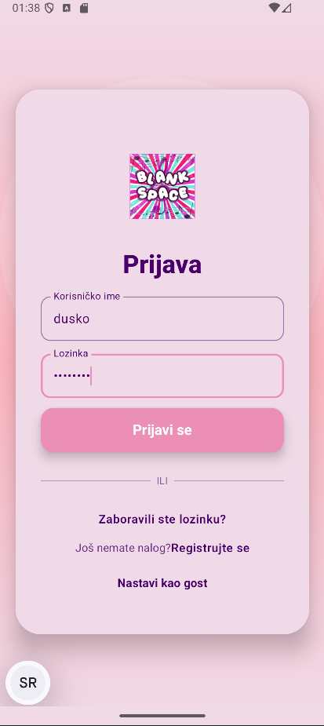
  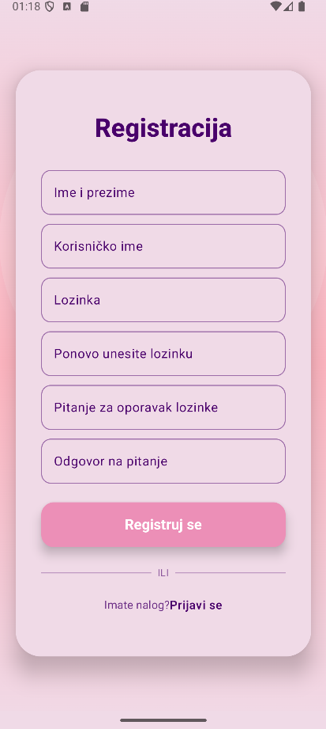
  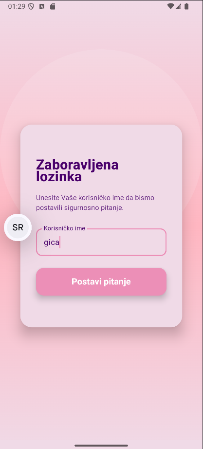
  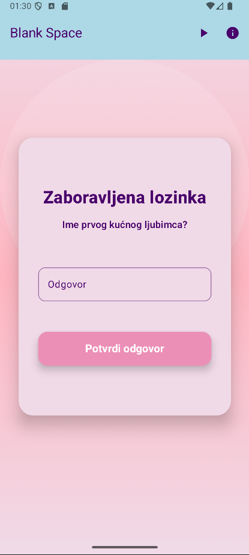
  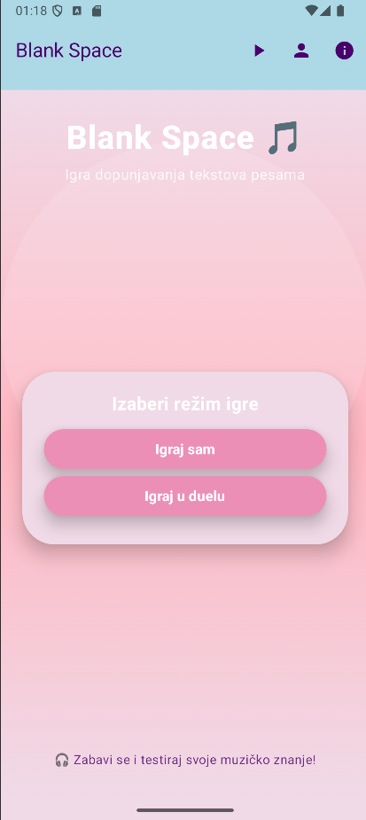
  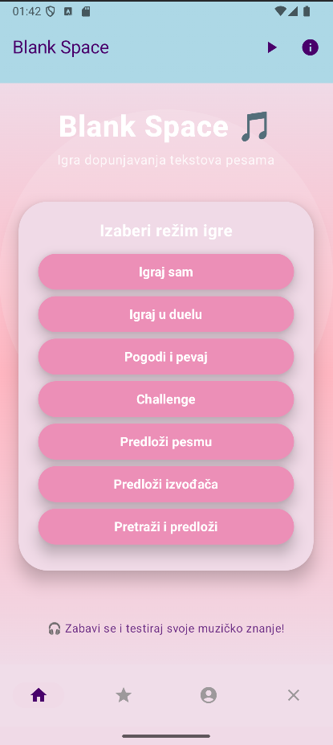
  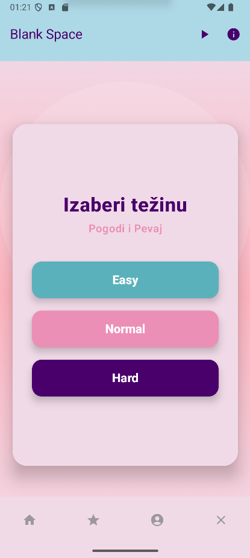
  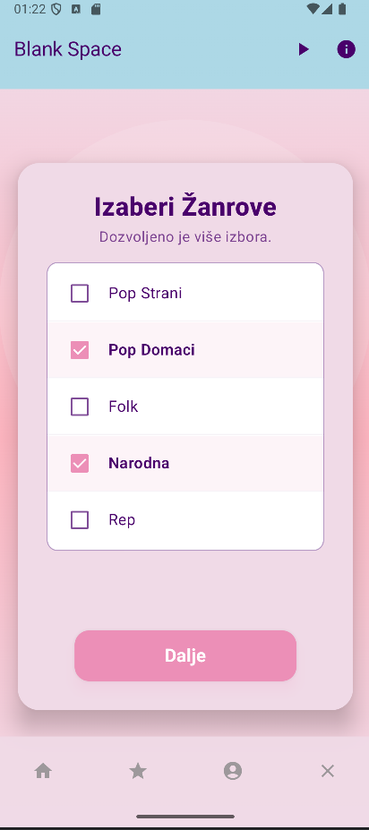
  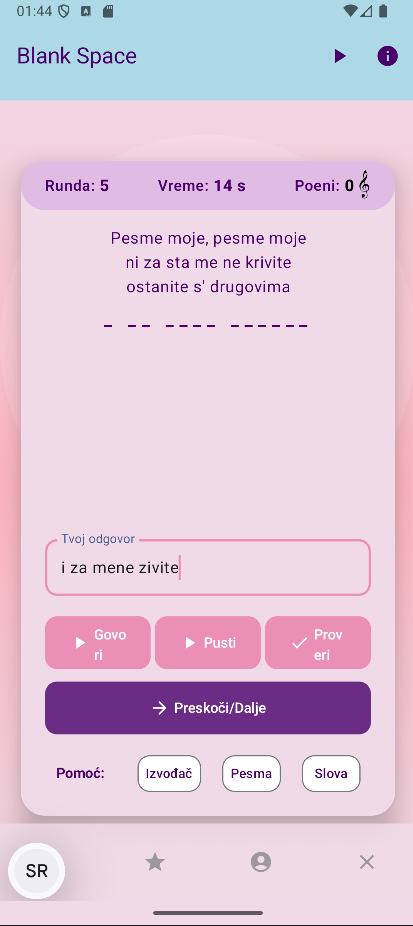
  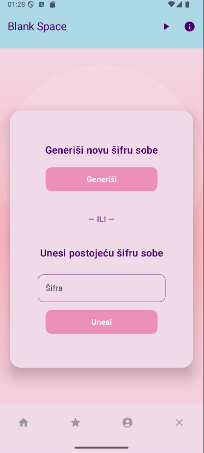
  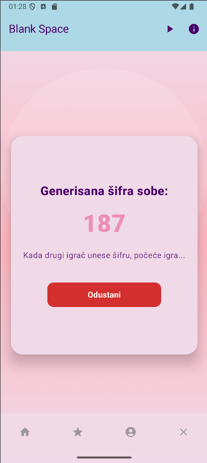
  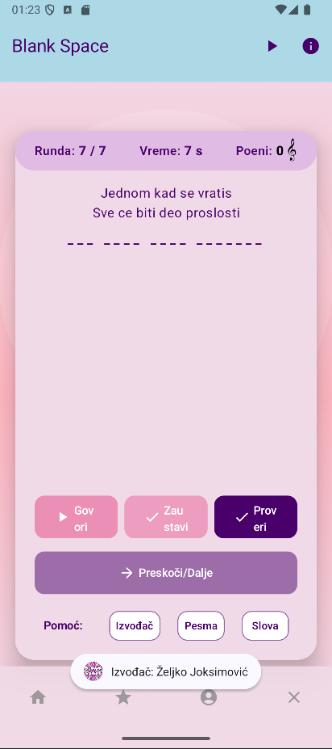
  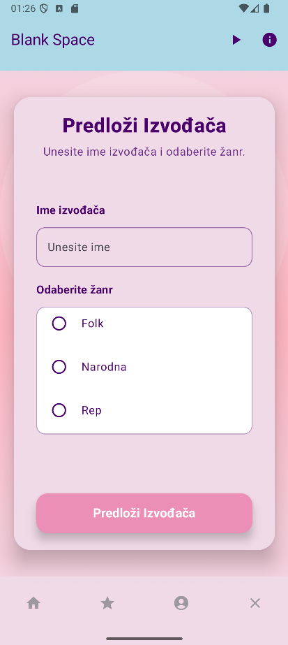
  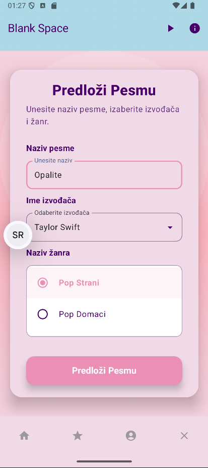
  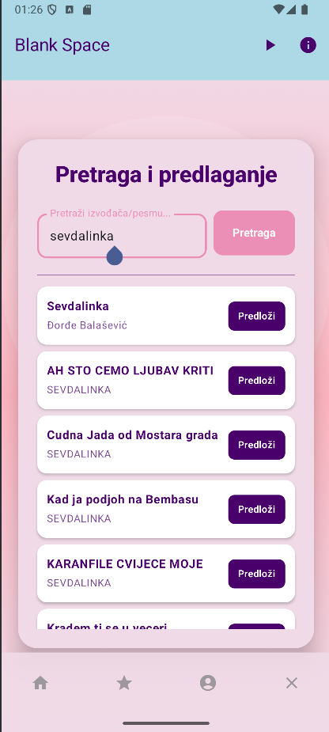
  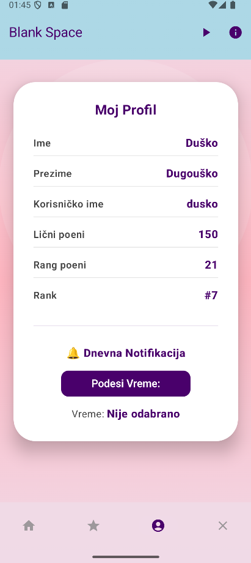
  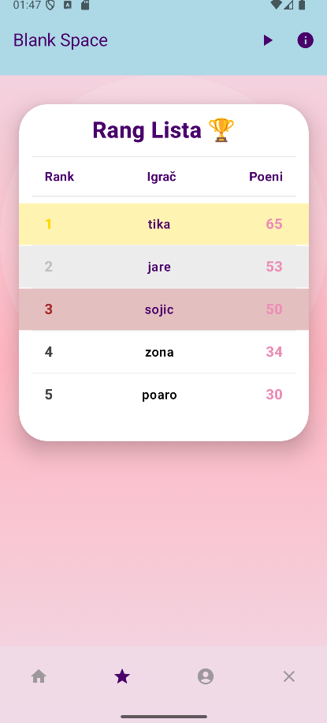
  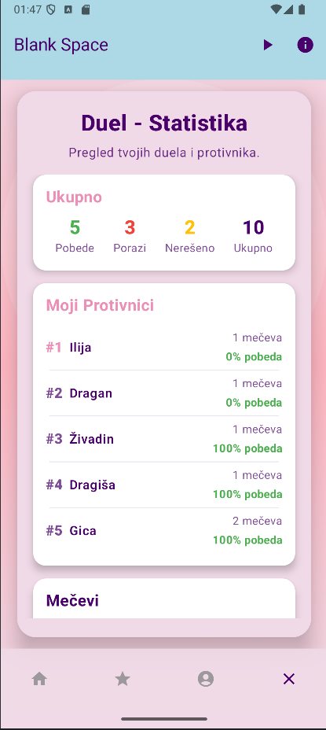
  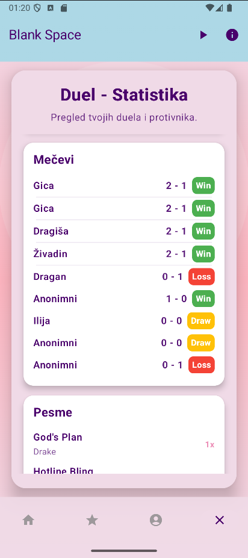
  

